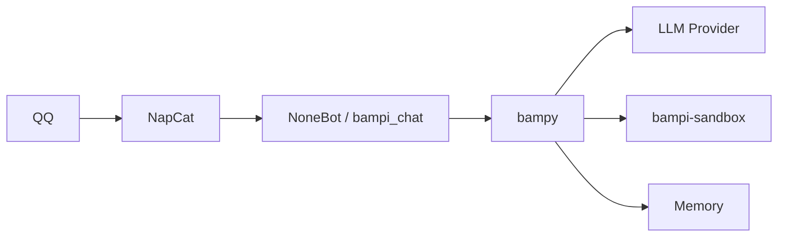

# Bampi

基于 NoneBot2 + OneBot v11 + NapCat 的 QQ 群聊 AI Agent；底层 Agent 能力由 [bampy](bampy/README.md) 提供。

## 功能亮点

- **群聊 Agent**：每群一个会话，用触发前缀（默认 `@bot`）或关键词唤醒，多轮对话与工具调用一体。
- **沙箱工具**：默认在 `bampi-sandbox` 容器内执行 bash / 文件等操作，workspace 挂载到宿主机。
- **记忆**：跨会话归档与检索，可按群积累长期上下文。
- **定时**：群内可创建定时任务，到点由 Bot 回调执行。
- **服务**：在沙箱中拉起临时 HTTP 等服务，并映射端口供访问。
- **Skills**：以 `SKILL.md` 能力包扩展行为；仓库可带内置 skills，启动时同步到 workspace，也可自行安装。
- **QQ 互动**：支持戳一戳、表情回应等群内互动（可配置开关）。

## 架构简图

一句话：**Bampi 把 bampy Agent 接到 QQ 群聊，并提供沙箱、记忆、定时、服务与 Skills。**

## 快速开始

要求：Python ≥ 3.12、[uv](https://docs.astral.sh/uv/)、Docker。

1. 安装依赖：`uv sync`
2. 复制环境文件：`cp .env.example .env`
3. 填写关键 `BAMPI_*`（模型与 API 等），详见 [快速开始](docs/guide/getting-started.md)
4. 启动 Docker：`docker compose up -d`（NapCat + 沙箱）
5. 按 OneBot v11 原则对接 NapCat ↔ NoneBot（`ACCESS_TOKEN` 一致等）
6. 启动 Bot：`uv run python bot.py`

完整步骤、冒烟与排错见 [docs/guide/getting-started.md](docs/guide/getting-started.md)。

## 文档索引

完整目录见 [docs/guide](docs/guide/README.md)。

| 文档 | 说明 |
|------|------|
| [快速开始](docs/guide/getting-started.md) | 环境、`.env`、Docker、NapCat 对接、首次启动 |
| [使用说明](docs/guide/usage.md) | 触发方式、命令、进度/流式、workspace、Skills 概念与命令 |
| [配置参考](docs/guide/configuration.md) | `BAMPI_*` 配置分组与完整面 |
| [架构](docs/guide/architecture.md) | Bot 侧架构与数据流 |
| [开发指南](docs/guide/development.md) | 目录、流程、测试、插件结构 |
| [bampy](bampy/README.md) | Agent 框架（机制细节见其文档，本仓库不复述） |
